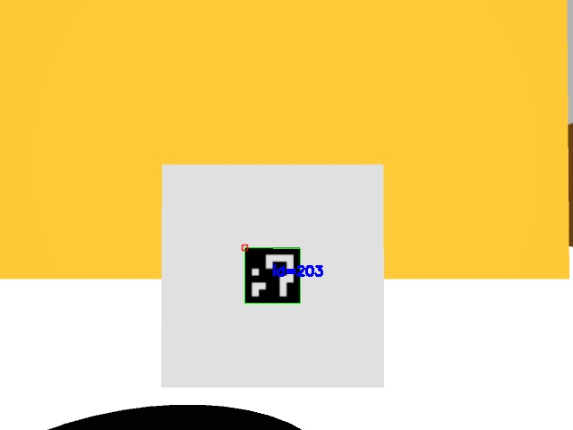

# aruco_ros2

A ros2 package for [detecting ArUco markers](https://docs.opencv.org/4.x/d5/dae/tutorial_aruco_detection.html). This package has been tested in ros2 Humble, Iron, and Jazzy.

# Dependencies

The package depends at the very leas on ros2 and OpenCV. You can install OpenCV with:

```bash
sudo apt install libopencv-dev
```

## build

```
colcon build
```

## Run

```
source install/setup.bash
ros2 run aruco_ros2 aruco_ros2 --ros-args \
  -p marker_size:=0.1 \
  -p camera_frame:=camera_rgb_optical_frame \
  -p image_topic:=/camera/color/image_raw \
  -p camera_info_topic:=/camera/color/camera_info \
  -p dictionary:=DICT_4X4_1000
```

A `MarkerArray` message is publish to the `/aruco/markers` topic

```bash
$ ros2 topic echo /aruco/markers
header:
  stamp:
    sec: 1736851604
    nanosec: 649643037
  frame_id: map
markers:
- header:
    stamp:
      sec: 3053
      nanosec: 650000000
    frame_id: map
  id: 705
  pose:
    position:
      x: 4.577914177731711
      y: 7.3721117161966
      z: 0.16769712996098787
    orientation:
      x: -0.034770853436485075
      y: -0.7320978400370252
      z: -0.04105639168193393
      w: 0.6790715080655944
  pixel_x: 353.0
  pixel_y: 296.0
---
```

An image with the marker coord axes drawn is publish to `/aruco/result`


